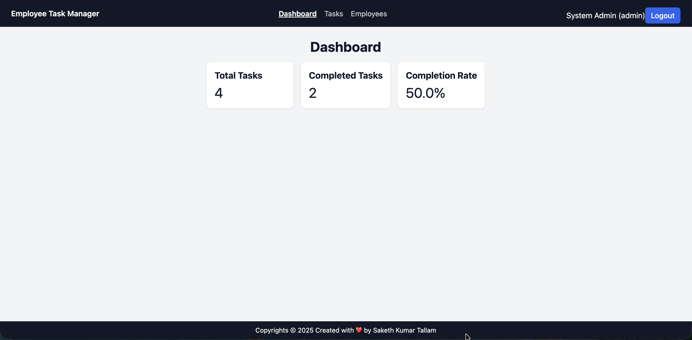
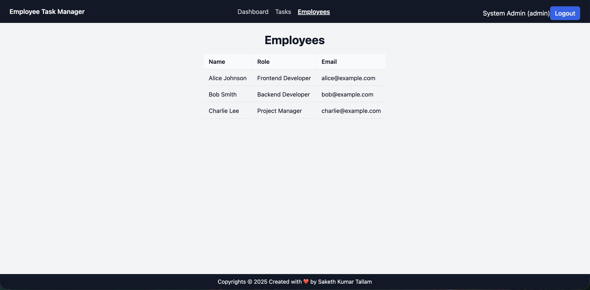
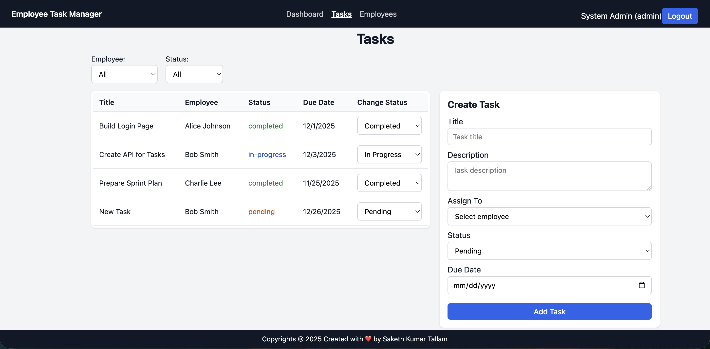
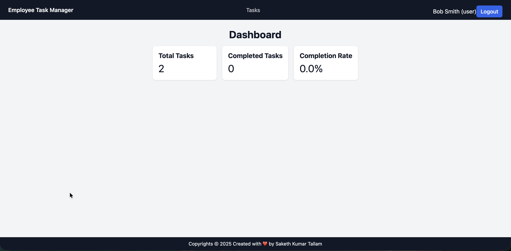
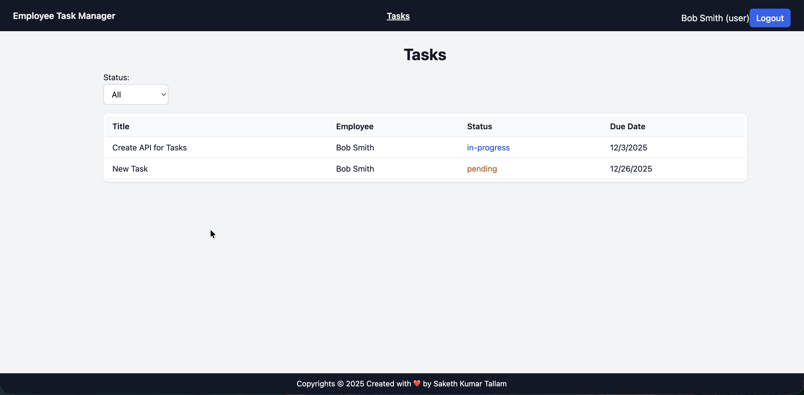

# 📌 Employee Task Manager

A full-stack MERN application to manage employees, assign tasks, and allow role-based access for administrators and users. Includes JWT authentication, dashboards, and task tracking with status updates.

---

## 🏗️ Tech Stack & Architecture Overview

### **Frontend**
- React (Vite)
- Axios for API calls
- React Router + Context API for Auth
- Custom CSS for UI

### **Backend**
- Node.js + Express.js
- JWT Authentication & Authorization
- REST API Architecture

### **Database**
- MongoDB Atlas (Cloud hosted)

## 🚀 Live Demo

🔗 **Frontend (Vercel):** https://employee-task-tracker-bice.vercel.app/  
🔗 **Backend API (Render):** https://employeetasktracker.onrender.com

---

### **Hosting**
| Platform | Purpose |
| :--- | :--- |
| **Render** | Backend hosting |
| **Vercel** | Frontend hosting |
| **MongoDB Atlas** | Database hosting |


### **Architecture Flow**
```text
    Frontend (Vercel)
        ↓ 
      Axios
        ↓ 
    Backend API (Render)
        ↓ 
    Mongoose
        ↓ 
    MongoDB Atlas
```
## ⚙️ Features

### 👑 Admin
- ✔ Add, update, and delete tasks
- ✔ Assign tasks to employees
- ✔ View dashboard with global metrics
- ✔ View all employees and their tasks

### 👤 User (Employee)
- ✔ Login and view their tasks only
- ✔ Update task progress status
- ✔ View personal dashboard statistics

---

## 🚀 Local Development Setup

### Clone the repository
```bash
git clone https://github.com/SakethKumarTallam/EmployeeTaskTracker.git
cd EmployeeTaskManager
```

## Backend Setup(/backend)
### Install Dependencies

```
cd backend
npm install
```
### Environment variables required → Create .env

```

MONGODB_URI=<your_mongodb_atlas_uri> // MongoDB Atlas connection string for deployment
PORT = 5001
JWT_SECRET=<your_jwt_secret> // Any Random String
SEED_DB=true
```

### Start development server

```
npm run dev
```
- Runs at: http://localhost:5001

## 2️⃣ Frontend Setup (/frontend)
### Install Dependencies

```
cd frontend
npm install
```

### Create .env.local

```
VITE_API_URL=http://localhost:5001
```
- In production you can replace this with backend deployment link in it.

### Start React app

```
npm run dev
```
- Runs at: http://localhost:5173

## 📡 API Endpoints

### Auth
| Method | Endpoint | Description |
| :--- | :--- | :--- |
| `POST` | `/auth/login` | Authenticate user and return JWT |

### Employees
| Method | Endpoint | Role | Description |
| :--- | :--- | :--- | :--- |
| `GET` | `/employees` | admin | Get all employees |

### Tasks
| Method | Endpoint | Role | Description |
| :--- | :--- | :--- | :--- |
| `GET` | `/tasks` | admin/user | Get tasks (admin gets all, user gets assigned only) |
| `POST` | `/tasks` | admin | Create task |
| `PUT` | `/tasks/:id` | admin | Update task status |

### Dashboard
| Method | Endpoint | Role | Description |
| :--- | :--- | :--- | :--- |
| `GET` | `/dashboard` | admin/user | Task completion summary |

---

## 📸 Screenshots

### 🏠 Admin Dashboard

Displays total tasks, completed tasks, and completion rate for the admin.

### 👥 Employees Management (Admin Only)

Admin can view all employees in the organization.

### 📋 Tasks Overview (Admin)

Admin can view all tasks, filter them, and assign or update statuses.

### 🧑‍💼 User Dashboard

Employees see only their assigned tasks and completion stats.

### 📌 User Tasks View

Displays the list of tasks assigned to a logged-in user.


## 📝 Assumptions
- Only admin users can create/update tasks.
- Each user is mapped to exactly one employee record.
- Authentication is JWT-based and stored in `localStorage`.

## ⚠️ Limitations
- ❌ No notifications or email alerts
- ❌ No real-time task updates (WebSockets not implemented)
- ❌ Basic UI styling (can be improved with Tailwind / Material UI)

## 💡 Future Enhancements
- 🔁 Real-time updates with Socket.IO
- 📱 Mobile-optimized UI theme
- 📊 Chart-based analytics for admin dashboard

---

## 🎉 Conclusion
This project demonstrates a complete production-ready MERN stack application with:
- ✔ Authentication
- ✔ Authorization
- ✔ Role-based UI
- ✔ Deployment on cloud services